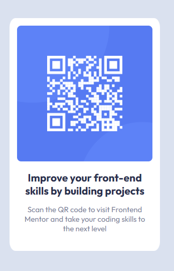

# Frontend Mentor - QR code component solution

This is my personal solution to the [QR code component challenge on Frontend Mentor](https://www.frontendmentor.io/challenges/qr-code-component-iux_sIO_H).
I start with the assumption that neither I nor my coding is perfect; so, if you have feedback, positive or negative, that you feel would be helpful, please send it my way (see profile info below). 

## Table of contents

- [Overview](#overview)
  - [Screenshot](#screenshot)
  - [Links](#links)
- [My process](#my-process)
  - [Built with](#built-with)
  - [What I learned](#what-i-learned)
  - [Continued development](#continued-development)
  - [Useful resources](#useful-resources)
- [Author](#author)
- [Acknowledgments](#acknowledgments)

## Overview

This was my first attempt to complete a Frontend Mentor (FM) coding challenge. While this project was not at all a difficult one, I felt like it was a good exercise in familiarizing myself with the FM process and workflow.

### Screenshot

Naturally, there is just one screenshot since the design is static and should appear the same on any screen wider than 350px. The screenshot is left uncropped to show the <body> background-color, the container's border-radius, etc.

### Links

- Solution URL: [Add solution URL here](https://your-solution-url.com)
- Live Site URL: [Add live site URL here](https://your-live-site-url.com)

## My process

### Built with

- HTML5
- CSS custom properties
- GoogleFonts
- Mobile-first workflow (even though this did not have relevance to whether the design was "responsive" or not)
- VisualStudio Code editor

### What I learned

- Basic FM workflow
- Development of a personal workflow / processes / organization for front-end development
- Honed my Git skills, versioning control, and pushing files to GitHub
- How to convert color formate quickly and easily right in VS Code

### Continued development

While none of the concepts utilized in this challenge were new to me, it is clear that I still have a way to go to give them "muscle memory." Each time I complete another project, the clarity of individual concepts, syntax, what is possible, etc. increases and I gain confidence.

Desired Areas of development:
- Continued gains in conceptual and practical mastery of HTML and CSS (and associated technologies)
- Improved integration of associated technologies / languages (React, Bootstrap, GoogleFonts, FontAwesome, etc.)
- Improved integration with back-end development skills, such as Node.js, to build interactive websites and apps
- Become more comfortable with CSS transformations, animations, and responsiveness.

### Useful resources

As a way of assessing the state of my raw abilities, no external resources were utilized for this challenge. 

## Author

Jeff Guleserian
- Frontend Mentor - [@jguleserian](https://www.frontendmentor.io/profile/jguleserian)
- GitHub - [@jguleserian](https://github.com/jguleserian)
- LinkedIn - [@jeffguleserian](https://www.linkedin.com/in/jeffguleserian/)

## Acknowledgments

While no one helped me complete this project, I am certainly open for critique and instruction. Since I am limited to only seeing from my own perspective, I would covet receiving the feedback of others. If you see something in my coding that is ineffecient, unclear, incorrect, could lead to problems or complications, please do not hesitate to leave me feedback.

Well, also, if you want to send me a word of encouragement, I certainly wouldn't reject it! :)

In short, any constructive feedback is welcomed and appreciated.
